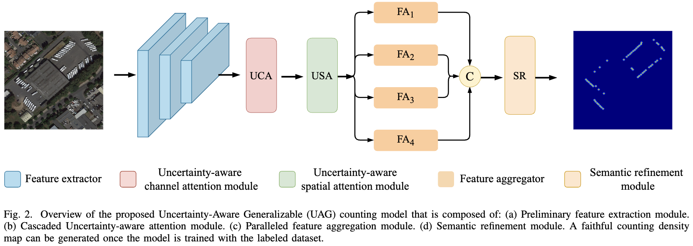

# Uncertainty Driven Generalizable Object Counting in Remote Sensing Images

This repository contains the code and resources associated with our paper titled "Uncertainty Driven Generalizable Object Counting in Remote Sensing Images". Please note that the paper is currently under review for publication.

The code is tested on Ubuntu 22.04 environment (Python3.9.0, PyTorch1.12.1) with an NVIDIA A100 GPU.

## Contents

- [Uncertainty Driven Generalizable Object Counting in Remote Sensing Images](#uncertainty-driven-generalizable-object-counting-in-remote-sensing-images)
  - [Contents](#contents)
  - [Introduction](#introduction)
  - [Train](#train)
  - [Test](#test)
  - [Results](#results)
    - [Visual Results](#visual-results)
    - [Quantitative Results](#quantitative-results)
  - [Citation](#citation)
  - [Acknowledgements](#acknowledgements)

## Introduction

UDG (Uncertainty Driven Generalizable) is a novel model designed for counting objects in remote sensing images. Motivated by the concept of uncertainty, UDG aims to enhance prediction accuracy and generalizability. By incorporating Monte Carlo (MC) dropout into the model, UDG generates multiple predictions and aggregates them to produce a more robust final output. Additionally, UDG takes into account data uncertainty to improve feature diversity and expand the hypothesis space, enabling better generalization to unseen domains. Extensive experiments demonstrate the superior performance of UDG compared to existing state-of-the-art methods.




## Train

1. Download RSOC Dataset form [HERE](https://captain-whu.github.io/DOTA).
2. Modify `scripts/train.sh` to specify your own train options.
3. After performing the above modifications, you can start the training process by running `bash scripts/train.sh`.

## Test

1. Modify `scripts/test.sh` to specify your own test options.
2. After performing the above modifications, you can start the testing process by running `bash scripts/test.sh`.

## Results

### Visual Results


### Quantitative Results


## Citation

If you find this code or research helpful, please consider citing our paper:

```BibTeX
@article{Li2023UDG,
title={Uncertainty Driven Generalizable Object Counting in Remote Sensing Images},
author={Li, Qilei and Gao, Mingliang and Chen, Jinyong and Zhai, Wenzhe and Guo, Xiangyu and Jeon, Gwanggil and Chehri, Abdellah},
journal={under_review}
year={2023},
}
```

Please note that this citation is a placeholder and will be updated with the actual citation information once the paper is accepted and published. We kindly request you to revisit this section and replace the placeholder with the correct citation detail.

## Acknowledgements

This code is built on [DSU](https://github.com/lixiaotong97/DSU) and [ASPDNet](https://github.com/gaoguangshuai/Counting-from-Sky-A-Large-scale-Dataset-for-Remote-Sensing-Object-Counting-and-A-Benchmark-Method). We thank the authors for sharing their codes.
